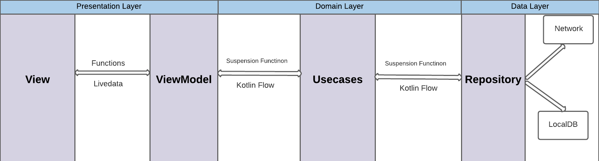

## Project Description

# Project Stack

- Architecture Pattern - MVVM- Clean Architecture
- Kotlin
- Kotlin Flow
- View Binding
- Room Database
- Retrofit
- OkkHttp Client
- Dagger-Hilt Dependency Injection
- Navigation Component
- Junit
- espresso

## Features

There are two screens in app.

- Search screen -- From this screen user can search images by typing from keyboard.
- Details screen -- From this screen user can the bigger version of images and information

# Project Code structure

I have used MVVM- Clean architecture pattern. I have included project diagram in root directory of
the project. There are two module in the project. App module consist the presentation layer which
will be visible to the user. Core module consist domain and data layer which are responsible to
fetch data from network and database.

App Theme

- By default dark mode is enable. You can enable light mode from App class. No way to set dark mode
  from app in current implementation. You need to replace this
  AppCompatDelegate.setDefaultNightMode(AppCompatDelegate.MODE_NIGHT_YES)
  by AppCompatDelegate.setDefaultNightMode(AppCompatDelegate.MODE_NIGHT_NO)

About pagination

- Pagination available only if there is internet available. If there is no internet, new data will
  be loaded from database if user type new search query from searchView.  
  About Test
- Only basic tests are available in this project.

 
 

 
 
 
 
 
 
 
 

 
